**RÉPUBLIQUE TUNISIENNE**

**MINISTÈRE DE L'EMPLOI ET DE LA FORMATION PROFESSIONNELLE**

**Institut des Sciences Privées Internationales (ISPRI)**

---

# RAPPORT DE PROJET DE FIN D'ÉTUDES

### Présenté en vue de l'obtention du Diplôme National de BTS en Informatique de Gestion


**Sujet :** *EcoDrive — Site web de showroom et de catalogue de véhicules électriques en Tunisie*

---

**Réalisé par :**

# Hayder BACCOURI

---

| | |
|---|---|
| **Encadrant** | Monsieur Nidhal TARHOUNI |
| **Réalisé au sein de** | Institut ISPRI — Projet personnel à but pédagogique |
| **Diplôme** | BTS Informatique de Gestion |

---

**Session (année universitaire) : Octobre 2024 / Octobre 2026**

```{=openxml}
<w:p><w:r><w:br w:type="page"/></w:r></w:p>
```

# Table des matières

1. Table des matières
2. Table des illustrations
3. Table des tableaux
4. Remerciements
5. Introduction générale
6. Chapitre 1 : Cadre général du projet
7. Chapitre 2 : Analyse des besoins
8. Chapitre 3 : Les choix techniques et l'environnement de développement
9. Chapitre 4 : Release 1 — Authentification, inscription et gestion des utilisateurs
10. Chapitre 5 : Release 2 — Catalogue, gestion des voitures et des bornes, réservation des essais
11. Chapitre 6 : Release 3 — Contact, newsletter, tableau de bord, audit et exports
12. Conclusion générale et perspectives
13. Glossaire
14. Bibliographie
15. Résumé / Abstract

---

# Table des illustrations

| N° | Libellé |
|---|---|
| Figure 1 | L'organigramme simplifié de l'ISPRI |
| Figure 2 | La carte conceptuelle d'EcoDrive |
| Figure 3 | Le diagramme de cas d'utilisation général |
| Figure 4 | Le diagramme de cas d'utilisation du client |
| Figure 5 | Le diagramme de cas d'utilisation de l'administrateur |
| Figure 6 | L'architecture 3-tiers d'EcoDrive |
| Figure 7 | Le diagramme de déploiement d'EcoDrive |
| Figure 8 | Le modèle MVC appliqué à EcoDrive |
| Figure 9 | Le diagramme de classes |
| Figure 10 | Le diagramme de cas d'utilisation du Sprint 1 |
| Figure 11 | Le diagramme de séquence d'authentification |
| Figure 12 | L'interface de connexion |
| Figure 13 | L'interface d'inscription |
| Figure 14 | Le cas d'utilisation « Gérer les utilisateurs » |
| Figure 15 | Le diagramme de séquence « Ajouter un utilisateur » |
| Figure 16 | L'interface de la liste des utilisateurs (admin) |
| Figure 17 | Le cas d'utilisation du catalogue |
| Figure 18 | Le diagramme de séquence « Rechercher et filtrer » |
| Figure 19 | L'interface du catalogue |
| Figure 20 | L'interface d'une fiche technique voiture |
| Figure 21 | Le cas d'utilisation « Gérer les voitures » |
| Figure 22 | L'interface d'ajout d'une voiture (admin) |
| Figure 23 | Le cas d'utilisation « Gérer les bornes » |
| Figure 24 | L'interface de la liste des bornes |
| Figure 25 | L'interface d'une fiche borne |
| Figure 26 | Le diagramme d'états-transitions d'une réservation |
| Figure 27 | Le diagramme de séquence « Réserver un essai » |
| Figure 28 | L'interface de réservation d'un essai |
| Figure 29 | L'interface de la liste des essais du client |
| Figure 30 | Le cas d'utilisation « Contact et newsletter » |
| Figure 31 | L'interface du formulaire de contact |
| Figure 32 | L'interface du tableau de bord d'administration |
| Figure 33 | L'interface des graphiques statistiques (admin) |
| Figure 34 | L'interface du journal d'audit |

---

# Table des tableaux

| N° | Libellé |
|---|---|
| Tableau 1 | Les acteurs Scrum |
| Tableau 2 | Le backlog du produit |
| Tableau 3 | La planification des releases |
| Tableau 4 | Les besoins fonctionnels par module |
| Tableau 5 | Les caractéristiques techniques de la machine de travail |
| Tableau 6 | L'environnement logiciel utilisé |
| Tableau 7 | La description des classes principales (extrait du modèle relationnel) |
| Tableau 8 | Le backlog du Sprint 1 |
| Tableau 9 | La description textuelle du cas d'utilisation « S'authentifier » |
| Tableau 10 | La description textuelle du cas d'utilisation « Créer un compte » |
| Tableau 11 | Le backlog du Sprint 2 |
| Tableau 12 | La description textuelle « Créer un utilisateur » (admin) |
| Tableau 13 | La description textuelle « Modifier profil » |
| Tableau 14 | Le backlog du Sprint 3 |
| Tableau 15 | La description textuelle « Consulter le catalogue » |
| Tableau 16 | Le backlog du Sprint 4 |
| Tableau 17 | La description textuelle « Ajouter une voiture » (admin) |
| Tableau 18 | La description textuelle « Ajouter une borne » (admin) |
| Tableau 19 | Le backlog du Sprint 5 |
| Tableau 20 | La description textuelle « Réserver un essai » |
| Tableau 21 | Le backlog du Sprint 6 |
| Tableau 22 | La description textuelle « Envoyer un message » |
| Tableau 23 | Le backlog du Sprint 7 |
| Tableau 24 | La description textuelle « Consulter le tableau de bord » (admin) |
| Tableau 25 | Les contrastes entre notre solution et les solutions existantes |

---

# Remerciements

C'est avec un immense plaisir que je remercie l'ensemble des personnes qui m'ont soutenu et aidé, de loin ou de près, à la réalisation de ce travail qui vient couronner l'aboutissement de plus de deux années de travail intense.

Ma première pensée est pour ma famille, foyer d'encouragement et d'amour tout au long de mon parcours académique. Merci du fond du cœur. Mon père est une source d'inspiration et de motivation sans fin par ses conseils et son encadrement ; il me guide inlassablement vers l'excellence. Je remercie ma mère pour sa foi en moi ; elle m'a toujours soutenu dans mes prises de décision et mes idées de projet. Qu'il me soit aussi permis de remercier mon frère et ma sœur pour leurs soutiens, leurs encouragements et leurs généreux conseils.

Je remercie sincèrement Monsieur **Nidhal Tarhouni**, mon encadrant, pour sa disponibilité, ses précieux conseils et le temps qu'il a bien voulu me consacrer tout au long de ce projet. Grâce à sa confiance j'ai pu m'accomplir pleinement dans mes missions et mener à bien ce travail.

Je remercie également tous les enseignants et les intervenants de l'**ISPRI** qui ont su me transmettre leurs savoirs. Certains m'ont permis de me passionner pour des sujets qui m'intéressaient peu, d'autres m'ont ouvert des horizons que je n'imaginais même pas. Enfin, une pensée particulière à tous mes collègues pour leur esprit d'équipe et leur soutien moral tout au long de ma formation.

---

# Introduction générale

L'industrie automobile mondiale vit une transition majeure : la mobilité électrique s'impose progressivement comme une alternative crédible face aux véhicules thermiques. De nombreux pays, dont la Tunisie, encouragent l'adoption des véhicules électriques (VE) à travers des incitations fiscales et le développement des infrastructures de recharge. Le marché tunisien voit ainsi émerger une demande croissante d'informations fiables, de catalogue produits à jour et de services associés (essais, installation de bornes de recharge…).

Cependant, la plupart des concessions automobiles ne disposent pas d'une vitrine web moderne, complète et intégrée : les informations sont souvent éparpillées entre les réseaux sociaux et les sites institutionnels, les fiches techniques sont incomplètes et il est rarement possible de réserver en ligne un essai de véhicule ou de commander une borne de recharge.

C'est dans ce cadre que s'inscrit le présent projet de fin d'études intitulé **« EcoDrive — Site web de showroom et de catalogue de véhicules électriques en Tunisie »**. Il s'agit d'un logiciel personnel conçu à but pédagogique, qui vise à couvrir l'ensemble du parcours client d'un concessionnaire de véhicules électriques : présentation du showroom, catalogue détaillé de 14 véhicules électriques, fiches produits des bornes de recharge, réservation d'essais en ligne, gestion de comptes utilisateurs et un panneau d'administration complet.

Ce document retrace les différentes étapes abordées depuis la conception jusqu'à la réalisation de ce projet. Il est constitué principalement de six chapitres :

- Le **premier chapitre** est une présentation générale du projet : le contexte, l'étude de l'existant et la méthodologie de travail adoptée.
- Le **deuxième chapitre** est consacré à l'étude des spécifications, des besoins fonctionnels et non fonctionnels, l'identification des acteurs et les diagrammes de cas d'utilisation.
- Le **troisième chapitre** porte sur le Sprint 0 : les choix techniques de la solution adoptée, les langages et les outils utilisés ainsi que l'architecture générale du système.
- Le **quatrième chapitre** est dédié à la réalisation de la première release, qui comporte les deux premiers sprints : authentification/inscription et gestion des utilisateurs.
- Le **cinquième chapitre** décrit la deuxième release : catalogue, gestion des voitures et des bornes, réservation des essais.
- Le **dernier chapitre** est dédié à la dernière release : contact, newsletter, tableau de bord, audit et exports.
- Finalement, nous clôturons notre rapport par une conclusion générale et les perspectives d'amélioration.

---

# Chapitre 1 : Cadre général du projet

## Introduction

Ce projet s'inscrit dans le cadre du projet de fin d'étude en vue de l'obtention du Diplôme National de BTS en **Informatique de Gestion**, assuré par l'**Institut des Sciences Privées Internationales (ISPRI)**. Il consiste en la réalisation d'un site web de showroom et de catalogue de véhicules électriques, développé en PHP, MySQL et JavaScript vanilla, sans framework, dans une démarche d'apprentissage personnel et d'auto-formation.

## I. Présentation de l'organisme de formation

### 1. Description générale

L'ISPRI — Institut des Sciences Privées International — est un institut de formation professionnelle **homologué**, spécialisé dans le développement des compétences des étudiants, des employés et des cadres. Il dispense des formations dans le domaine de l'informatique et de la gestion, dont le **BTS en Informatique de Gestion**, diplôme national permettant d'acquérir les compétences nécessaires au développement et à l'administration de systèmes d'information, à l'analyse et à la conception de bases de données, ainsi qu'à la programmation web et applicative. L'institut est localisé à Tunis.

### 2. Activités et services

L'institut propose des programmes accélérés, pratiques et adaptés aux besoins du marché du travail, notamment :

- La **formation diplômante BTS en Informatique de Gestion** (2 années, session octobre) ;
- Les **langues** étrangères (allemand, français, anglais, italien, espagnol) ;
- La **bureautique et l'informatique** (Word, Excel, PowerPoint, outils digitaux) ;
- Le **management et l'administration** ;
- Les formations **BTP & BTS**, la **formation continue** et la **formation commerciale** ;
- Un encadrement avec des formateurs qualifiés, des stages garantis et des certifications reconnues.

L'adage de l'institut : « Ispri Formation, votre évolution, notre mission ».

### 3. Organigramme simplifié

La figure suivante présente un organigramme simplifié de l'institut.

```
                        ┌─────────────────────────┐
                        │  Direction de l'ISPRI   │
                        └────────────┬────────────┘
                                     │
              ┌──────────────────────┼──────────────────────┐
              │                      │                      │
   ┌──────────┴──────────┐ ┌─────────┴─────────┐ ┌──────────┴──────────┐
   │  Coordination       │ │  Corps formateur  │ │  Administration &   │
   │  pédagogique        │ │  (certifiés)      │ │  Support (RH, adv.) │
   └─────────────────────┘ └───────────────────┘ └─────────────────────┘
              │                      │
   ┌──────────┴──────────┐ ┌─────────┴─────────┐
   │ Filières BTS &      │ │ Langues, Bureau-  │
   │ Informatique        │ │ tique, Management │
   └─────────────────────┘ └───────────────────┘
```

**[Figure 1 : L'organigramme simplifié de l'ISPRI.]**

*(À remplacer par l'organigramme officiel de l'institut si disponible.)*

## II. Étude de l'existant

### 1. Introduction

Le marché des véhicules électriques en Tunisie est en pleine croissance. Les concessionnaires et les importateurs présentent leurs modèles via des sites vitrines ou des pages sur les réseaux sociaux, tandis que les places de marché généralistes (petites annonces) offrent une visibilité sans réel service associé. Dans ce contexte, nous constatons que les solutions existantes présentent plusieurs lacunes :

- Fiches techniques incomplètes ou inaccessibles ;
- Aucune possibilité de réserver un essai en ligne ;
- Absence de gestion centralisée des demandes de contact ;
- Absence de statistiques pour le responsable ;
- aucune interface d'administration pour ajouter ou modifier les produits.

### 2. Critique de l'existant

Nous pouvons citer quelques exemples de solutions existantes :

- **Sites des concessionnaires :** présentations commerciales des modèles, mais souvent statiques, sans catalogue paramétrable ni espace client ;
- **Places de marché généralistes :** annonces de véhicules, mais sans fiches techniques normalisées ni services associés (essai, bornes) ;
- **Sites de services de recharge :** informations sur les bornes, mais aucun lien avec un catalogue de véhicules.

Le tableau ci-dessous présente une comparaison rapide des fonctionnalités existantes.

| Fonctionnalité | Sites concessionnaires | Places de marché | Solutions dédiées VE | Notre solution |
|---|---|---|---|---|
| Catalogue détaillé | Partiel | Oui | Variable | Oui |
| Fiches techniques normalisées | Non | Non | Variable | Oui |
| Réservation d'essai en ligne | Non | Non | Rarement | Oui |
| Espace client | Non | Oui | Variable | Oui |
| Panneau d'administration | Non | Non | Variable | Oui |
| Statistiques et export | Non | Non | Non | Oui |

*Tableau 25 : Les contrastes entre notre solution et les solutions existantes.*

### 3. Solution proposée

La solution retenue est le développement d'une application web complète et autonome, baptisée **EcoDrive**, qui couvre :

- Un **showroom** accueillant avec sélection de véhicules mis en avant ;
- Un **catalogue** de 14 véhicules électriques avec filtres, tri et pagination ;
- Des **fiches techniques** détaillées (motorisation, batterie, autonomie, recharge) ;
- Des **bornes de recharge** (marque Exicom) avec fiches produits ;
- Une **réservation d'essais** en ligne avec gestion des créneaux ;
- Un **espace client** (inscription, connexion, profil, historique des essais) ;
- Un **panneau d'administration** complet (gestion des voitures, bornes, réservations, messages, newsletter, utilisateurs, audit) ;
- Un **journal d'audit** traçant chaque action d'administration ;
- Des **exports** CSV et une **sauvegarde SQL** ;
- Une **sécurité renforcée** : CSRF, requêtes préparées, rate limiting, hachage des mots de passe.

La figure suivante présente la **carte conceptuelle** du projet, qui schématise l'idée globale d'EcoDrive et les liens entre ses différents modules.

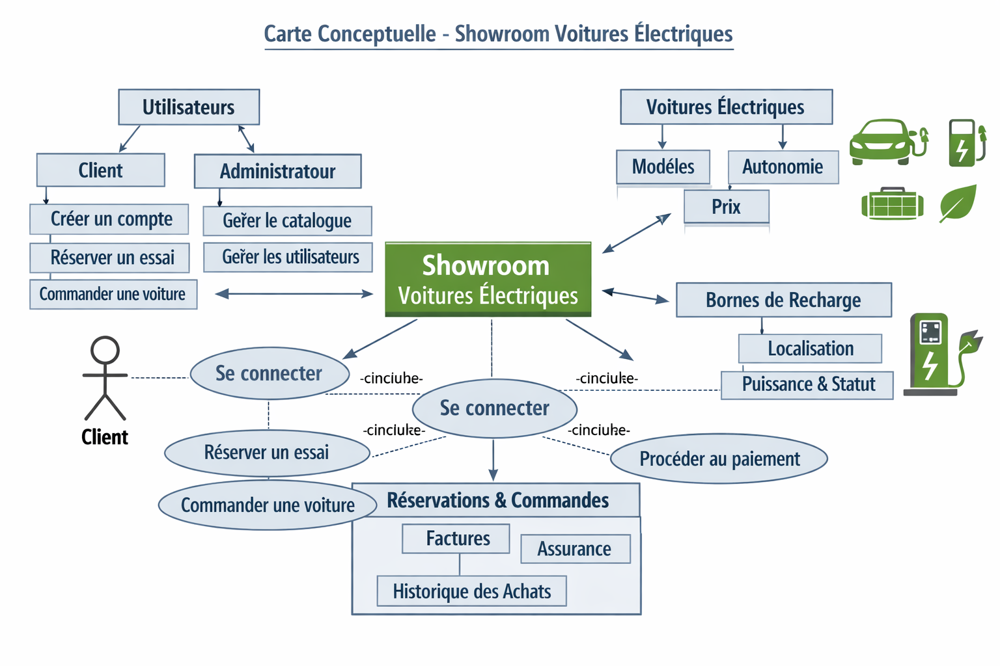

## III. Méthodologie de travail et modélisation

Pour la conduite du projet, nous avons adopté une méthode agile inspirée de **Scrum**, structurée en sprints et en releases, et nous avons utilisé **UML** (Unified Modeling Language) comme langage de modélisation pour spécifier, visualiser et construire l'architecture du système.

### 1. Méthodologie agile

Une méthode agile est une approche itérative et incrémentale menée dans un esprit collaboratif. Elle permet de livrer un produit fonctionnel à la fin de chaque itération (sprint). Parmi les méthodes agiles les plus connues : DSDM, Scrum, RAD, Extreme Programming (XP), ASD, Test Driven Development (TDD) et Crystal Clear.

### 2. Pourquoi Scrum ?

Nous avons opté pour le framework **Scrum** qui consiste à développer le logiciel de manière incrémentale en maintenant une liste totalement transparente des demandes d'évolutions à implémenter. Ses avantages :

- Gagner plus de contrôle sur le produit final ;
- Augmenter l'efficacité ;
- Assurer des livraisons de haute qualité ;
- Accroître la satisfaction des utilisateurs.

### 3. Les artefacts de Scrum

- **Backlog produit** : liste priorisée des besoins ;
- **Sprint backlog** : extrait du backlog produit pour le sprint courant ;
- **Sprint** : itération de développement (2 à 4 semaines) ;
- **Mêlée quotidienne** : point de contrôle quotidien ;
- **Produit livrable** : livré au propriétaire du produit à la fin du sprint.

### 4. Les acteurs Scrum

| Acteur | Rôle |
|---|---|
| **Product Owner** | Porteur de la vision du projet, gère le backlog, définit les priorités |
| **Scrum Master** | Veille au bon déroulement, lève les obstacles, facilite le travail |
| **Équipe de développement** | Autogérée, développe le produit sprint après sprint |

*Tableau 1 : Les acteurs Scrum.*

### 5. Langages de modélisation

Pour la phase de conception, nous avons utilisé **UML** afin de représenter la structure statique (diagrammes de classes, diagrammes de cas d'utilisation) et la vue dynamique (diagrammes de séquence, diagrammes d'états-transitions) du système.

## Conclusion

Dans ce chapitre, nous avons présenté le cadre général du projet, l'organisme de formation, l'étude de l'existant ainsi que la méthodologie de travail adoptée. Le chapitre suivant sera consacré à l'analyse des besoins.

---

# Chapitre 2 : Analyse des besoins

## Introduction

Ce chapitre est consacré à l'étude des besoins fonctionnels et non fonctionnels du système, à l'identification des acteurs et à l'élaboration du backlog produit avec une planification des sprints.

## I. Étude des besoins

### 1. Besoins fonctionnels

| Module | Besoin |
|---|---|
| Showroom | Afficher une sélection de véhicules « mis en avant » sur la page d'accueil |
| Catalogue | Lister les véhicules avec filtres (recherche, marque, prix, année) et tri |
| Fiches techniques | Afficher motorisation, batterie, autonomie, recharge, dimensions |
| Bornes | Présenter les bornes de recharge Exicom avec fiches produits |
| Réservation | Réserver un créneau d'essai en ligne avec règles de validation |
| Espace client | Inscription, connexion, profil, historique des essais |
| Admin | Gérer les voitures, les bornes, les réservations, les messages, la newsletter, les utilisateurs |
| Audit | Journaliser chaque action d'administration |
| Export | Exporter les données en CSV et réaliser une sauvegarde SQL |
| SEO | Sitemap dynamique, robots.txt, balises meta, JSON-LD |

*Tableau 4 : Les besoins fonctionnels par module.*

### 2. Besoins non fonctionnels

- **Sécurité** : authentification obligatoire pour les espaces privés, tokens CSRF sur tous les formulaires, requêtes préparées (anti-injection SQL), rate limiting (connexion, inscription, contact, newsletter), hachage bcrypt des mots de passe, session régénérée à la connexion ;
- **Fiabilité** : journalisation des erreurs dans `private/logs/`, sauvegarde de secours des emails ;
- **Ergonomie** : interface responsive, sémantique HTML, animations légères ;
- **Performance** : pagination, indexation MySQL, cache navigateur, compression gzip ;
- **Accessibilité** : conformité aux bonnes pratiques web, pages 404 et SEO ;
- **Compatibilité** : PHP 8, MySQL/MariaDB, Apache (XAMPP), navigateurs modernes ;
- **Extensibilité** : architecture modulaire, configuration centralisée (`.env`).

## II. Identification des acteurs

### 1. Le visiteur

C'est l'utilisateur non connecté. Il peut consulter le showroom, le catalogue, les fiches techniques, les bornes, les pages statiques (contact, mentions légales, CGV, CGU, confidentialité), s'inscrire et s'authentifier.

### 2. Le client

C'est l'utilisateur authentifié. En plus des droits du visiteur, il peut réserver un essai, consulter son profil, modifier ses informations personnelles et consulter l'historique de ses essais.

### 3. L'administrateur

C'est le gestionnaire du site. Il dispose de tous les droits du client et, en plus, il gère les voitures (CRUD + mise en avant), les bornes (CRUD), les réservations (confirmation, annulation), les messages de contact, la newsletter, les utilisateurs (rôles, suppression) et consulte les statistiques et le journal d'audit.

## III. Diagrammes de cas d'utilisation et backlog du produit

### 1. Diagrammes de cas d'utilisation

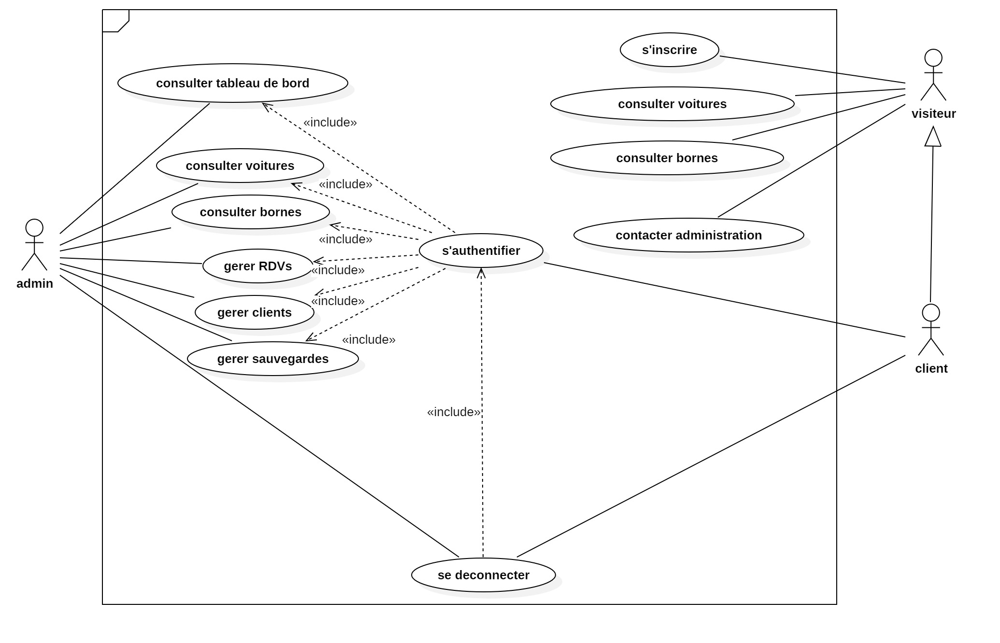

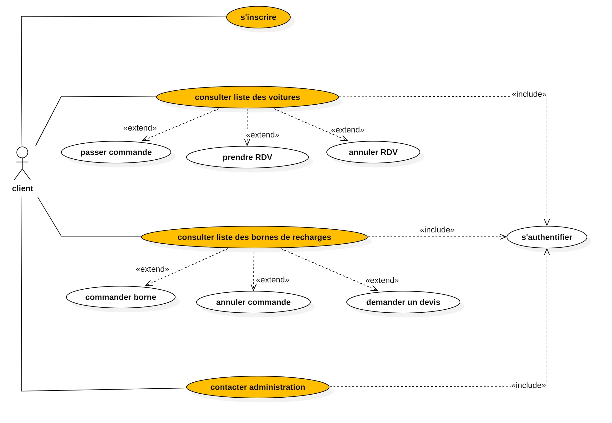

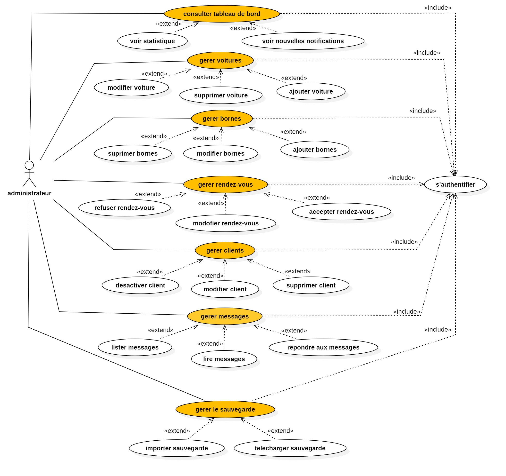

### 2. Backlog du produit

| N° | Sprint | User Story | Acteur | Priorité | Dates |
|---|---|---|---|---|---|
| 00 | Choix techniques | Installation de l'environnement de développement | — | 01 | Oct – Nov 2025 |
| 01 | Authentification et inscription | Connexion, inscription, vérification email, mot de passe oublié | Visiteur | 02 | Nov – Déc 2025 |
| 02 | Gestion des utilisateurs | Créer, consulter, modifier, supprimer utilisateurs ; modifier profil | Admin, Client | 03 | Déc – Jan 2026 |
| 03 | Catalogue | Consulter le catalogue, filtrer, trier, fiche détail | Visiteur | 04 | Jan – Fév 2026 |
| 04 | Gestion des voitures et bornes | CRUD voitures, bornes, mise en avant, pages auto-générées | Admin | 05 | Fév – Mar 2026 |
| 05 | Réservation d'essais | Réserver un essai, mes essais, export calendrier | Client | 06 | Mar – Avr 2026 |
| 06 | Contact et newsletter | Formulaire de contact, inscription newsletter | Visiteur | 07 | Avr – Mai 2026 |
| 07 | Tableau de bord, audit et exports | Statistiques, journal d'audit, exports CSV, sauvegarde SQL | Admin | 08 | Mai – Juin 2026 |

*Tableau 2 : Le backlog du produit.*

### 3. Planification des releases

| Release | Chapitre | Sprints |
|---|---|---|
| Release 1 (« Sprint 0 ») | Chapitre 3 | Choix techniques et environnement |
| Release 1 | Chapitre 4 | Sprint 1 : Authentification et inscription • Sprint 2 : Gestion des utilisateurs |
| Release 2 | Chapitre 5 | Sprint 3 : Catalogue • Sprint 4 : Voitures et bornes • Sprint 5 : Réservation d'essais |
| Release 3 | Chapitre 6 | Sprint 6 : Contact et newsletter • Sprint 7 : Tableau de bord, audit et exports |

*Tableau 3 : La planification des releases.*

## Conclusion

Dans ce chapitre, nous avons effectué l'analyse des besoins qui nous a permis de comprendre les fonctionnalités attendues, d'identifier les acteurs et de présenter le backlog du produit ainsi que la planification des sprints.

---

# Chapitre 3 : Sprint 0 — Les choix techniques et l'environnement de développement

## Introduction

Ce chapitre est consacré à la présentation des choix techniques de la solution adoptée : les langages, les outils et l'environnement de développement, ainsi que l'architecture générale du système.

## I. Les choix techniques

### 1. PHP 8 et MySQL

**PHP** est un langage de script généraliste, particulièrement adapté au développement web, côté serveur. PHP 8 offre des performances accrues, un typage plus riche et des fonctions intégrées de sécurité (hachage de mots de passe, filtres de validation). Pourquoi PHP ?

- Simple à prendre en main, adapté à l'apprentissage ;
- Fonctionnement natif avec Apache et MySQL (pile XAMPP) ;
- Grande communauté et documentation riche (`php.net`) ;
- Requêtes préparées avec `mysqli` pour la sécurité ;
- Déploiement simple sur un serveur mutualisé.

**MySQL** (via **MariaDB** dans XAMPP) est un système de gestion de base de données relationnelle (SGBDR). Pourquoi MySQL ?

- Gratuit, open source, largement répandu ;
- Robustesse et support de `utf8mb4` (émojis et multilingue) ;
- Indexation et optimisation des requêtes ;
- Transactions et clés étrangères.

### 2. HTML, CSS et JavaScript vanilla

- **HTML5 sémantique** : structure accessible et référençable (`article`, `section`, `time`, JSON-LD) ;
- **CSS3** : variables CSS, grid/flexbox, responsive design, animations de révélation ;
- **JavaScript vanilla** : menu burger, carrousel, validation de formulaires côté client (`data-validate`), gestion de la confirmation de suppression.

Le choix du **vanilla** (sans framework) s'explique par la démarche pédagogique du projet : comprendre les mécanismes fondamentaux du web avant l'utilisation de bibliothèques.

### 3. Les bibliothèques et API utilisées

- **Chart.js 4.4.7** : bibliothèque JavaScript open source pour la visualisation de données (graphiques en barres, doughnut) utilisée dans le tableau de bord client et dans les statistiques de l'administration ;
- **Leaflet 1.9.4** + **OpenStreetMap** : cartographie légère pour la page de contact ;
- **Cormorant Garamond** : police typographique (Google Fonts) ;
- **iCalendar (RFC 5545)** : export `.ics` d'un créneau de réservation ;
- **schema.org (JSON-LD)** : balisage de données structurées `LocalBusiness` et `Product`.

## II. Environnement de travail

### 1. Environnement matériel

| Caractéristique | Valeur |
|---|---|
| Processeur | Intel Core i7 |
| Mémoire RAM | 8 à 16 Go |
| Stockage | SSD 512 Go |
| Système d'exploitation | Windows 10/11 |

*Tableau 5 : Les caractéristiques techniques de la machine de travail.*

### 2. Environnement logiciel

| Logiciel | Description |
|---|---|
| **XAMPP** | Pile logicielle libre (Apache, MariaDB, PHP, Perl) pour serveur web local |
| **Visual Studio Code** | Éditeur de code open source avec autocomplétion, débogage et intégration Git |
| **MySQL Workbench / phpMyAdmin** | Administration graphique de la base de données |
| **Git + GitHub** | Gestion de versions et hébergement du dépôt (`github.com/hayderbaccouri/ecodrive`) |
| **Postman** | Tests des API et des flux HTTP |
| **Draw.io / edraw** | Outils de modélisation UML |

*Tableau 6 : L'environnement logiciel utilisé.*

## III. Architecture générale du système

### 1. Architecture physique (3-tiers)

L'application est développée selon une **architecture 3-tiers** logique :

- **Couche présentation** : pages HTML générées côté serveur, CSS, JavaScript ;
- **Couche métier** : logique applicative en PHP (`php/*.php`) : authentification, réservation, validation, rôles ;
- **Couche accès aux données** : accès MySQL via `mysqli` avec requêtes préparées.

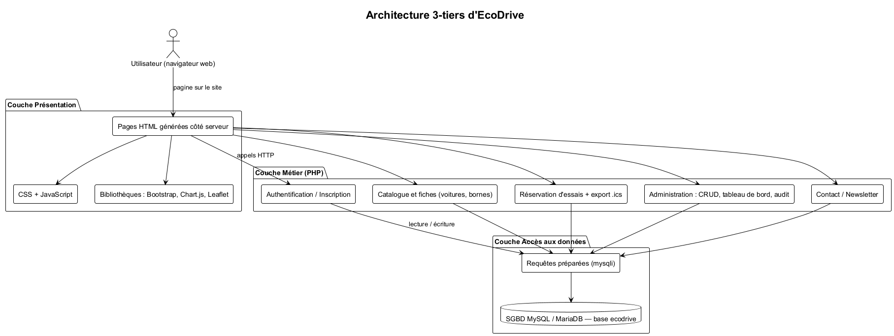

### 2. Diagramme de déploiement

Les principaux nœuds :

- **Client (navigateur)** : accès aux pages publiques et privées via HTTP/HTTPS ;
- **Serveur web Apache (XAMPP)** : interprétation PHP, réécritures `.htaccess`, sécurité ;
- **SGBD MySQL/MariaDB** : stockage des données (voitures, bornes, utilisateurs, réservations, audit…) ;
- **Système de messagerie** : envoi d'emails via `mail()` avec journal local de secours.

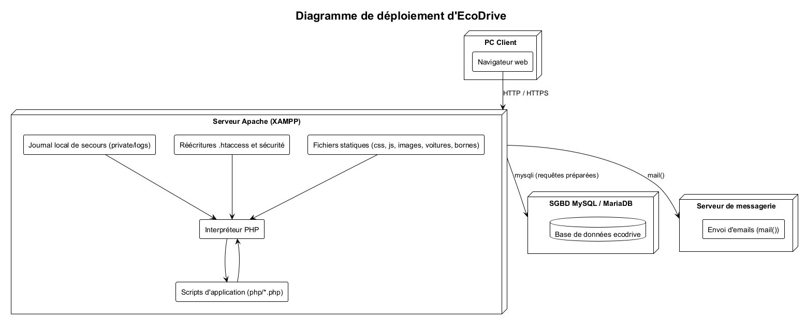

### 3. Architecture logique (MVC)

Nous avons structuré le code selon un modèle proche du **MVC** adapté au PHP sans framework :

- **Modèle** : données + accès base (`base-de-donnees/ecodrive.sql`, requêtes préparées, `php/car_data.php`) ;
- **Vue** : templates `php/partials/` (header, footer, meta, jsonld) et pages HTML ;
- **Contrôleur** : scripts d'action (`php/admin.php`, `php/reservation.php`, `php/connexion.php`, etc.).

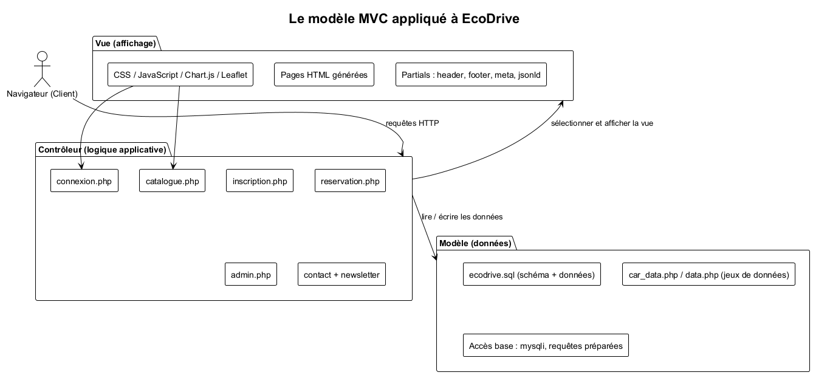

### 4. Modèle de données

Le schéma relationnel regroupe les entités suivantes (description partielle) :

| Classe | Attributs |
|---|---|
| **utilisateur** | id_utilisateur, nom, email, telephone, mot_de_passe, role (client/admin), email_verified, reset_token… |
| **voiture** | id_voiture, marque, modele, annee, prix, description, image, battery_kwh, horsepower, range_km, is_featured… |
| **borne** | id_borne, nom, modele, puissance, prix, description, image, details_page… |
| **reservation** | id_reservation, utilisateur_id, voiture_id, date_essai, heure_debut, heure_fin, statut (pending/confirmed/cancelled), notes |
| **contact_message** | id, nom, email, telephone, sujet, message, created_at |
| **newsletter_subscribers** | id, email, subscribed_at |
| **admin_audit** | id, admin_id, admin_name, action, details, created_at |
| **login_attempts** | id, ip_address, email, attempted_at, success |
| **rate_limits** | id, bucket, created_at |

*Tableau 7 : La description des classes principales (extrait du modèle relationnel).*

La figure suivante présente le diagramme de classes du système.

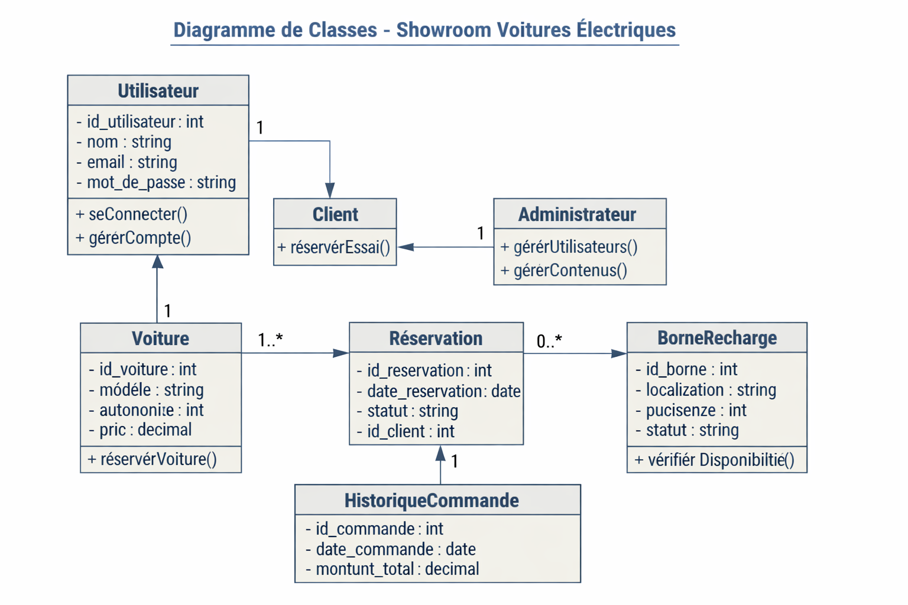

## Conclusion

Dans ce chapitre, nous avons présenté les choix techniques, l'environnement de développement et l'architecture générale du système. Le chapitre suivant aborde la réalisation de la première release.

---

# Chapitre 4 : Release 1 — Authentification, inscription et gestion des utilisateurs

## Introduction

Ce premier release comprend deux sprints :

- **Sprint 1 :** « Authentification et inscription » ;
- **Sprint 2 :** « Gestion des utilisateurs ».

Le développement de chaque sprint passe par quatre étapes : backlog du sprint, analyse, conception et réalisation.

## I. Développement du Sprint 1 « Authentification et inscription »

### 1. Backlog du Sprint 1

| Tâche | Priorité | Durée |
|---|---|---|
| Création des vues (accueil, connexion, inscription, mot de passe oublié, vérification email) | 2 | 7 jours |
| Création de la route d'inscription, de connexion, des validations, du rate limiting | 1 | 16 jours |
| Tests des flux (inscription, connexion, reset, vérification email) et correction des erreurs | 3 | 7 jours |

*Tableau 8 : Le backlog du Sprint 1.*

### 2. Analyse et spécification des besoins

Chaque utilisateur doit s'authentifier via un **email et un mot de passe** avant d'accéder aux fonctionnalités privées. Le système vérifie les données contre la base, régénère la session à la connexion et applique un rate limiting pour limiter les tentatives.

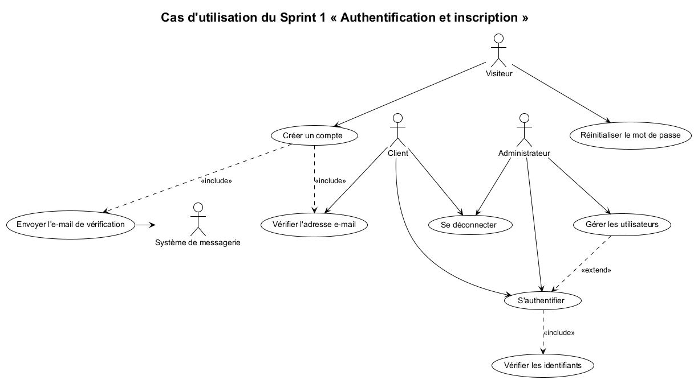

#### Description textuelle « S'authentifier »

| Élément | Description |
|---|---|
| **Résumé** | Permet à l'utilisateur de se connecter et d'accéder aux fonctionnalités privées |
| **Acteurs** | Visiteur (inscrit), Client, Administrateur |
| **Pré-condition** | Utilisateur non authentifié |
| **Post-condition** | Utilisateur authentifié |
| **Scénario nominal** | 1. L'utilisateur demande de s'authentifier ; 2. Le système affiche le formulaire ; 3. L'utilisateur saisit email et mot de passe puis clique « Connexion » ; 4. Le système valide les données (CSRF, format) ; 5. Le système vérifie l'existence de l'utilisateur et le mot de passe (bcrypt) ; 6. Le système régénère la session et affiche l'accueil |
| **Scénario d'erreur** | Champs vides ; format invalide ; utilisateur introuvable ; mot de passe incorrect ; limite de tentatives atteinte (5/15 min) |

*Tableau 9 : La description textuelle du cas d'utilisation « S'authentifier ».*

#### Description textuelle « Créer un compte »

| Élément | Description |
|---|---|
| **Résumé** | Permet à un visiteur de créer un compte client |
| **Acteurs** | Visiteur |
| **Pré-condition** | Visiteur non authentifié |
| **Post-condition** | Compte créé, email de vérification envoyé |
| **Scénario nominal** | 1. L'utilisateur clique sur « Inscription » ; 2. Le système affiche le formulaire ; 3. L'utilisateur saisit nom, email, téléphone et mot de passe (≥ 8 caractères) ; 4. Le système valide et vérifie l'unicité de l'email ; 5. Le système crée le compte (hash bcrypt, token de vérification 24 h) et envoie l'email ; 6. Le système affiche un message de succès |
| **Scénario d'erreur** | Champs vides ; mot de passe trop court ; email invalide ou déjà utilisé ; limite d'inscriptions (5/h) |

*Tableau 10 : La description textuelle du cas d'utilisation « Créer un compte ».*

### 3. Conception

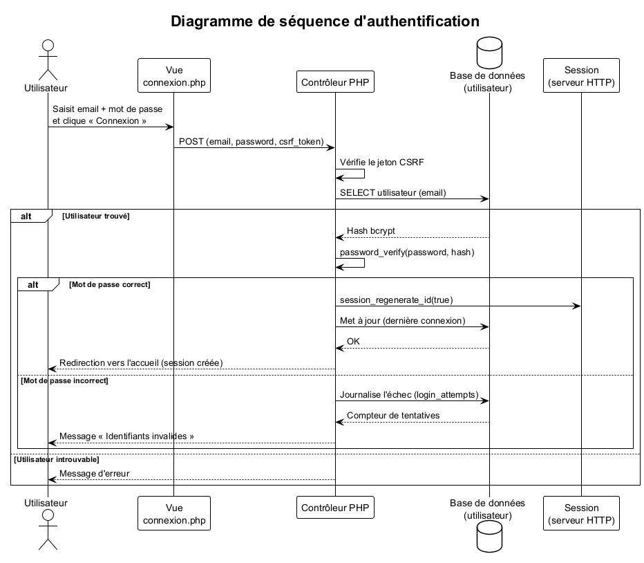

### 4. Réalisation


Le module d'authentification est implémenté dans `php/connexion.php`, `php/inscription.php`, `php/mot-de-passe-oublie.php`, `php/reinitialiser-mot-de-passe.php` et `php/verifier-email.php`, avec les fonctions de sécurité de `php/bootstrap.php` (CSRF, sessions sécurisées, rate limiting).

## II. Développement du Sprint 2 « Gestion des utilisateurs »

### 1. Backlog du Sprint 2

| Tâche | Priorité | Durée |
|---|---|---|
| Création des vues : lister/ajouter/modifier/supprimer utilisateurs, modifier profil | 2 | 7 jours |
| Contrôleurs, services et requêtes préparées côté PHP | 1 | 16 jours |
| Tests et correction des erreurs | 3 | 7 jours |

*Tableau 11 : Le backlog du Sprint 2.*

### 2. Analyse et spécification des besoins

L'administrateur peut créer des utilisateurs, changer leur rôle (client / administrateur) et les supprimer (après suppression de leurs réservations). Chaque utilisateur peut modifier son profil. Toutes les actions administratives sont tracées dans `admin_audit`.

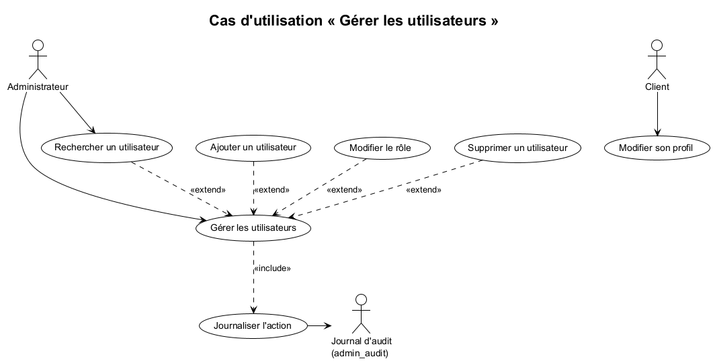

#### Description textuelle « Créer un utilisateur » (admin)

| Élément | Description |
|---|---|
| **Résumé** | L'administrateur ajoute un utilisateur |
| **Acteurs** | Administrateur |
| **Pré-condition** | Administrateur authentifié |
| **Post-condition** | Utilisateur créé et enregistré en base |
| **Scénario nominal** | 1. L'admin ouvre « Utilisateurs » ; 2. Le système affiche la liste et le formulaire d'ajout ; 3. L'admin renseigne les données et enregistre ; 4. Le système valide (CSRF, unicité email, mot de passe) ; 5. Le système insère l'utilisateur et journalise l'action |
| **Scénario d'erreur** | Données invalides ; échec d'insertion ; email existant |

*Tableau 12 : La description textuelle « Créer un utilisateur » (admin).*

#### Description textuelle « Modifier profil »

| Élément | Description |
|---|---|
| **Résumé** | Permet à tout utilisateur de modifier son propre profil |
| **Acteurs** | Client, Administrateur |
| **Pré-condition** | Utilisateur authentifié |
| **Post-condition** | Profil mis à jour |
| **Scénario nominal** | 1. L'utilisateur ouvre « Profil » ; 2. Le système affiche ses informations ; 3. L'utilisateur modifie et enregistre ; 4. Le système valide et met à jour en base ; 5. Message de succès |
| **Scénario d'erreur** | Données invalides ; échec de mise à jour |

*Tableau 13 : La description textuelle « Modifier profil ».*

### 3. Conception

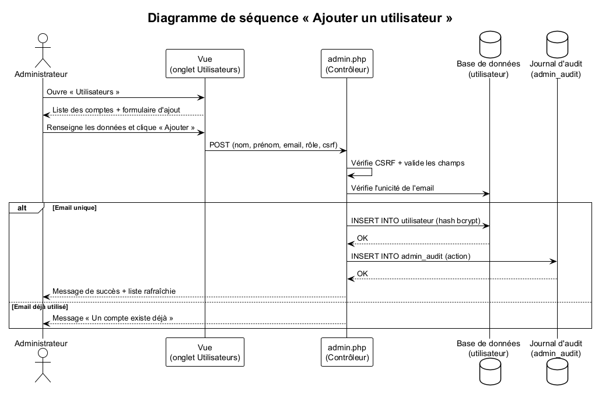

### 4. Réalisation

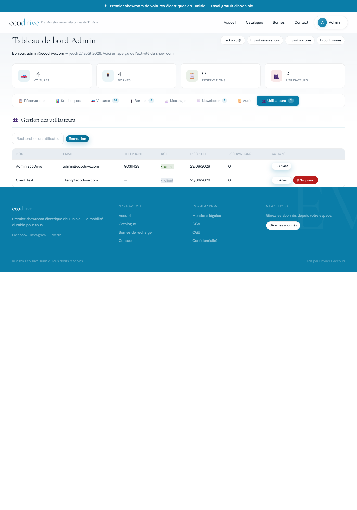

Le panneau d'administration (`php/admin.php`, onglet « Utilisateurs ») permet la recherche, le changement de rôle et la suppression des comptes, avec journalisation dans `admin_audit` à chaque action.

## Conclusion

À travers ce chapitre, nous avons présenté la première release : l'authentification, l'inscription et la gestion des utilisateurs, avec la partie conception (diagrammes) et la réalisation effective de ces fonctionnalités.

---

# Chapitre 5 : Release 2 — Catalogue, gestion des voitures et des bornes, réservation des essais

## Introduction

Cette deuxième release comprend trois sprints :

- **Sprint 3 :** « Catalogue » ;
- **Sprint 4 :** « Gestion des voitures et des bornes » ;
- **Sprint 5 :** « Réservation d'essais ».

## I. Développement du Sprint 3 « Catalogue »

### 1. Backlog du Sprint 3

| Tâche | Priorité | Durée |
|---|---|---|
| Création des vues : liste du catalogue, filtres, tri, pagination | 2 | 7 jours |
| Requêtes de filtrage, tri et pagination côté PHP (requêtes préparées) | 1 | 10 jours |
| Tests et correction des erreurs | 3 | 5 jours |

*Tableau 14 : Le backlog du Sprint 3.*

### 2. Analyse et spécification des besoins

Le visiteur consulte le catalogue des 14 véhicules électriques. Il peut rechercher par mot-clé, filtrer par marque, par tranche de prix et par année, trier (popularité, prix, année) et naviguer par pagination (9 véhicules par page). Chaque véhicule dispose d'une fiche technique dédiée.

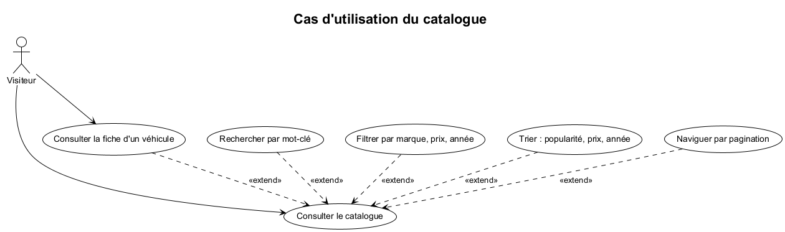

#### Description textuelle « Consulter le catalogue »

| Élément | Description |
|---|---|
| **Résumé** | Permet de parcourir le catalogue et de consulter une fiche véhicule |
| **Acteurs** | Visiteur (sans authentification) |
| **Pré-condition** | Aucune |
| **Post-condition** | Liste filtrée/triée affichée |
| **Scénario nominal** | 1. Le visiteur ouvre le catalogue ; 2. Le système affiche la première page (9 véhicules) ; 3. Le visiteur applique filtres/tri ; 4. Le système exécute la requête et affiche les résultats ; 5. Le visiteur clique sur un véhicule ; 6. Le système affiche la fiche technique |
| **Scénario d'erreur** | Aucun résultat (message dédié) ; page introuvable (404) |

*Tableau 15 : La description textuelle « Consulter le catalogue ».*

### 3. Conception

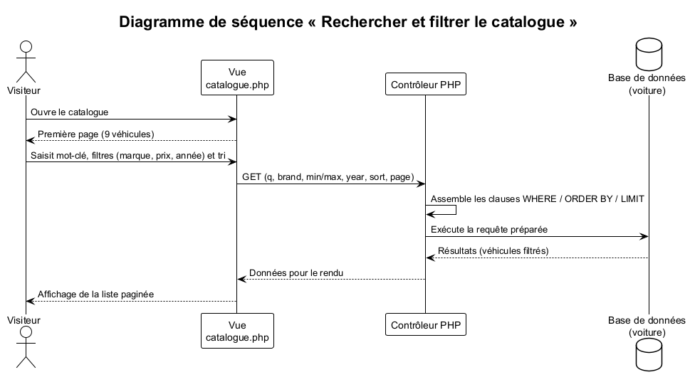

### 4. Réalisation


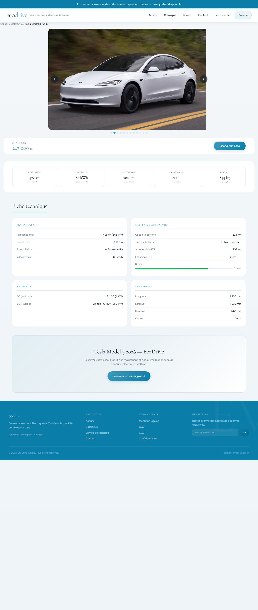

Le catalogue est implémenté dans `php/catalogue.php` (filtres, tri, pagination), complété par les fiches techniques `php/car-page.php` et le jeu de données `voitures/data.php` (14 modèles : Audi A6 e-tron, BMW iX3, BYD Atto 3, BYD Dolphin Surf, Kia EV-3, Mercedes Classe C et EQC, MG4, Peugeot e-208, Porsche Taycan, Tesla Model 3 et Model S Plaid, Toyota bZ4X, Geely EX2).

## II. Développement du Sprint 4 « Gestion des voitures et des bornes »

### 1. Backlog du Sprint 4

| Tâche | Priorité | Durée |
|---|---|---|
| Création des vues : CRUD voitures, CRUD bornes, mise en avant, upload d'images | 2 | 8 jours |
| Contrôleurs, services, requêtes préparées, génération des pages détail | 1 | 14 jours |
| Tests et correction des erreurs | 3 | 7 jours |

*Tableau 16 : Le backlog du Sprint 4.*

### 2. Analyse et spécification des besoins

L'administrateur gère les **voitures** (marque, modèle, année, prix, batterie kWh, puissance, autonomie, description, image, page détail, mise en avant sur l'accueil) et les **bornes de recharge** (nom, modèle, puissance, prix, description, image). À chaque ajout, une **page détail « stub »** est automatiquement générée (`voitures/<slug>.php` ou `bornes/<slug>.php`). L'upload d'images est sécurisé (5 Mo max, types autorisés).

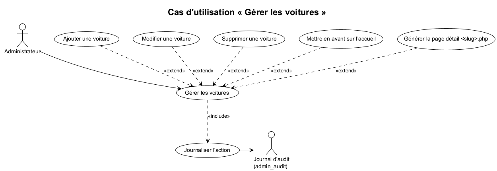

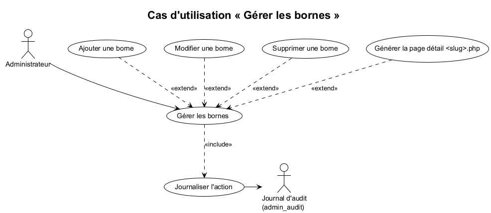

#### Description textuelle « Ajouter une voiture » (admin)

| Élément | Description |
|---|---|
| **Résumé** | L'administrateur ajoute une voiture au catalogue |
| **Acteurs** | Administrateur |
| **Pré-condition** | Administrateur authentifié |
| **Post-condition** | Voiture enregistrée, page détail générée, action journalisée |
| **Scénario nominal** | 1. L'admin ouvre l'onglet « Voitures » ; 2. Le système affiche le formulaire ; 3. L'admin saisit les caractéristiques, choisit une image et opte pour la mise en avant ; 4. Le système valide et insère ; 5. Le système génère la page détail et trace l'action |
| **Scénario d'erreur** | Données invalides ; image non conforme ; échec d'insertion |

*Tableau 17 : La description textuelle « Ajouter une voiture » (admin).*

#### Description textuelle « Ajouter une borne » (admin)

| Élément | Description |
|---|---|
| **Résumé** | L'administrateur ajoute une borne de recharge |
| **Acteurs** | Administrateur |
| **Pré-condition** | Administrateur authentifié |
| **Post-condition** | Borne enregistrée et page détail générée |
| **Scénario nominal** | 1. L'admin ouvre l'onglet « Bornes » ; 2. Le système affiche le formulaire ; 3. L'admin saisit la fiche produit ; 4. Le système valide et insère ; 5. Le système génère la page détail et trace l'action |
| **Scénario d'erreur** | Données invalides ; échec d'insertion |

*Tableau 18 : La description textuelle « Ajouter une borne » (admin).*

### 3. Réalisation

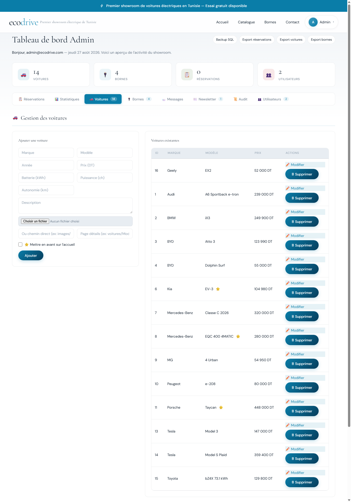


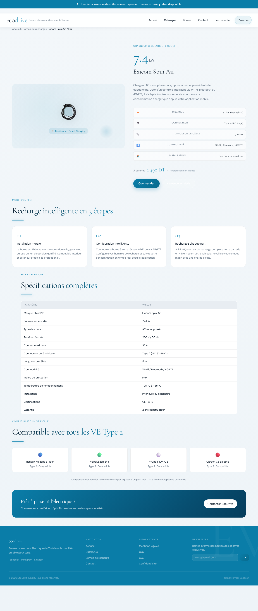

Les bornes présentées sont les modèles **Exicom** : Spin Air 7 kW, Spin Air 11 kW, Spin Air 22 kW et Spin Free 3 kW, avec fiche produit (puissance, connecteur Type 2, installation, prix) et boutons « Commander » / « Demander un devis ».

## III. Développement du Sprint 5 « Réservation d'essais »

### 1. Backlog du Sprint 5

| Tâche | Priorité | Durée |
|---|---|---|
| Création des vues : formulaire de réservation, confirmation, historique « Mes essais » | 2 | 7 jours |
| Logique de réservation : créneaux, validations, conflits, statuts ; export calendrier | 1 | 12 jours |
| Tests et correction des erreurs | 3 | 5 jours |

*Tableau 19 : Le backlog du Sprint 5.*

### 2. Analyse et spécification des besoins

Le client connecté réserve un **essai** pour un véhicule choisi, sur un créneau horaire d'une heure. Les règles : du lundi au samedi, créneaux de 8 h à 17 h, pas de chevauchement avec un créneau déjà réservé. La réservation passe par les statuts *pending*, *confirmed*, *cancelled*. Le client reçoit un email et peut ajouter le créneau à son calendrier (export `.ics`).

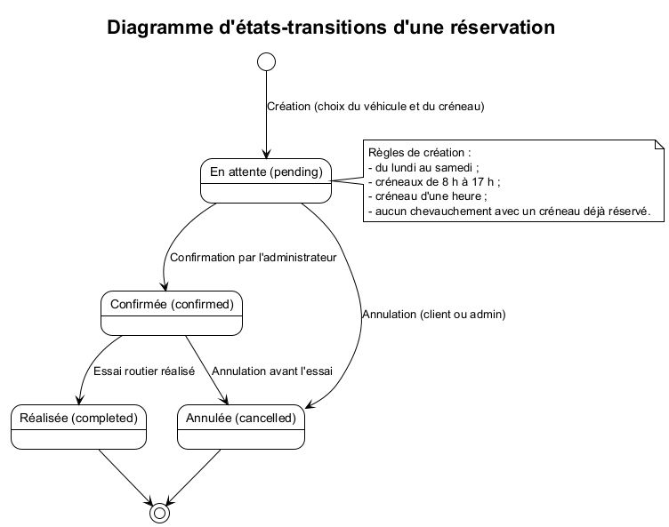

#### Description textuelle « Réserver un essai »

| Élément | Description |
|---|---|
| **Résumé** | Le client réserve un essai routier pour un véhicule |
| **Acteurs** | Client (connecté) |
| **Pré-condition** | Client authentifié |
| **Post-condition** | Réservation créée avec statut *pending*, email envoyé |
| **Scénario nominal** | 1. Le client choisit un véhicule puis clique « Réserver un essai » ; 2. Le système affiche le formulaire en deux étapes (véhicule, créneau) ; 3. Le client choisit date et heure ; 4. Le système vérifie les règles (jour, heure, conflit) ; 5. Le système enregistre la réservation, envoie l'email et affiche la confirmation (+ export .ics) |
| **Scénario d'erreur** | Créneau indisponible ; jour/heure invalide (dimanche, hors 8 h–17 h) ; client non connecté (redirection) |

*Tableau 20 : La description textuelle « Réserver un essai ».*

### 3. Conception

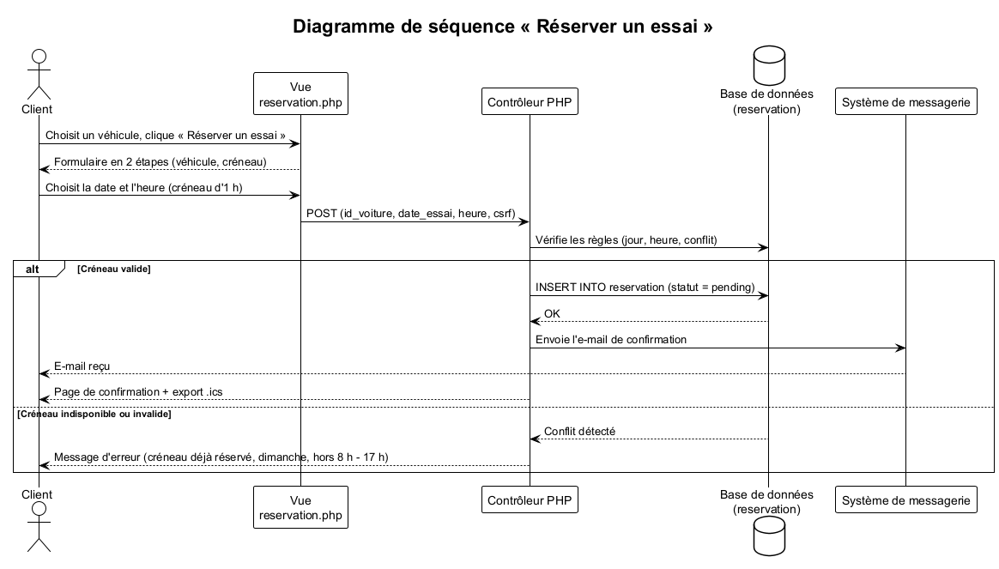

### 4. Réalisation

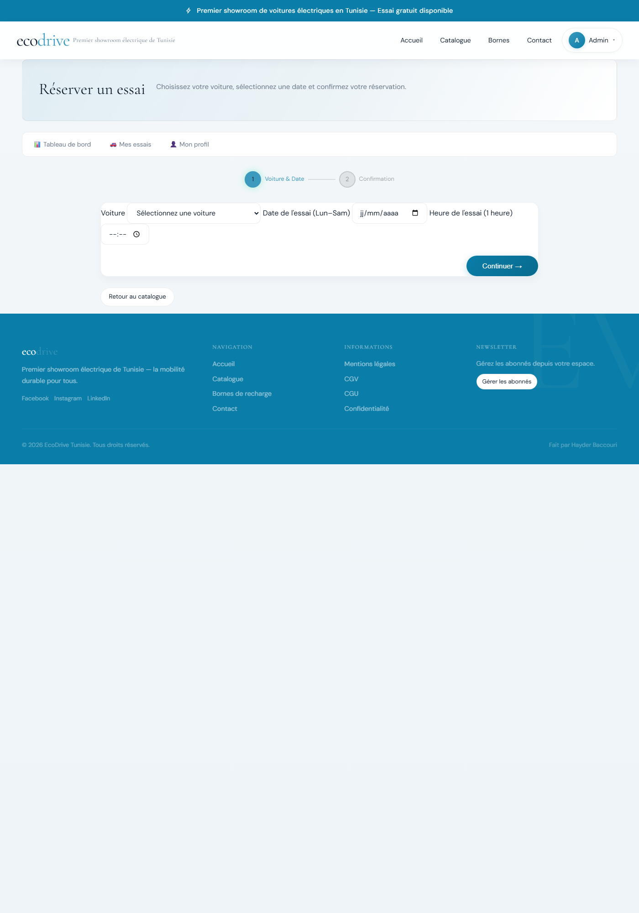

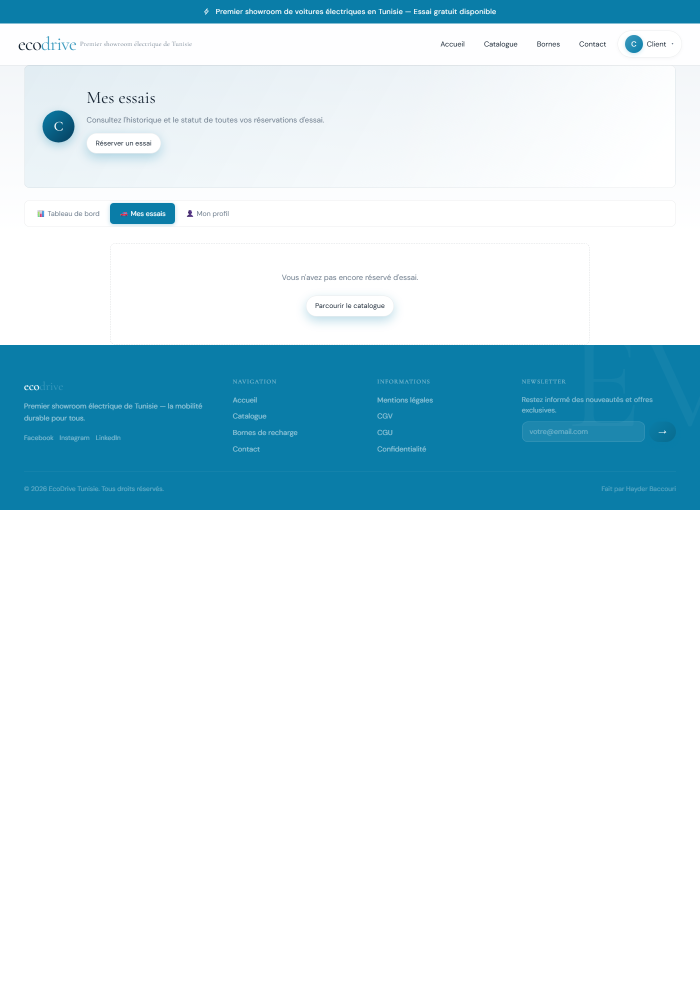

Le module est implémenté dans `php/reservation.php`, `php/mes-essais.php`, `php/tableau-de-bord.php` (KPIs et graphiques Chart.js), `php/confirmation-reservation.php` et `php/export-ics.php`.

## Conclusion

Dans ce chapitre, nous avons réalisé les trois sprints de la deuxième release : le catalogue, la gestion des voitures et des bornes, et la réservation des essais. Le chapitre suivant est consacré à la dernière release.

---

# Chapitre 6 : Release 3 — Contact, newsletter, tableau de bord, audit et exports

## Introduction

Cette dernière release comprend deux sprints :

- **Sprint 6 :** « Contact et newsletter » ;
- **Sprint 7 :** « Tableau de bord, audit et exports ».

## I. Développement du Sprint 6 « Contact et newsletter »

### 1. Backlog du Sprint 6

| Tâche | Priorité | Durée |
|---|---|---|
| Création des vues : formulaire de contact, inscription newsletter | 2 | 3 jours |
| Traitement, persistance, emails, rate limiting et anti-spam | 1 | 5 jours |
| Tests et correction des erreurs | 3 | 1 jour |

*Tableau 21 : Le backlog du Sprint 6.*

### 2. Analyse et spécification des besoins

Le visiteur envoie un **message de contact** (nom, email, téléphone, sujet, message ≥ 10 caractères) qui est persisté dans `contact_message`, notifié par email et consultable dans l'administration. Il peut également **s'abonner à la newsletter** (email unique, anti-spam 3/heure). Une carte **Leaflet/OpenStreetMap** affiche la localisation du showroom.

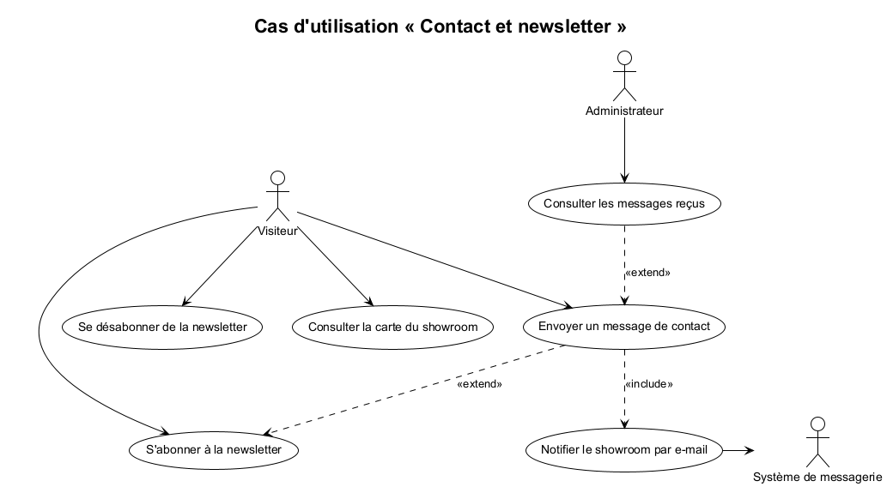

#### Description textuelle « Envoyer un message »

| Élément | Description |
|---|---|
| **Résumé** | Permet au visiteur de contacter le showroom |
| **Acteurs** | Visiteur |
| **Pré-condition** | Aucune |
| **Post-condition** | Message enregistré et notifié |
| **Scénario nominal** | 1. Le visiteur ouvre « Contact » ; 2. Le système affiche le formulaire et la carte ; 3. Le visiteur remplit et envoie ; 4. Le système valide (CSRF, format, rate limiting) ; 5. Le système persiste le message, envoie l'email et affiche la confirmation |
| **Scénario d'erreur** | Champs vides ; message trop court ; limite de 3 messages/10 min atteinte |

*Tableau 22 : La description textuelle « Envoyer un message ».*

### 3. Réalisation

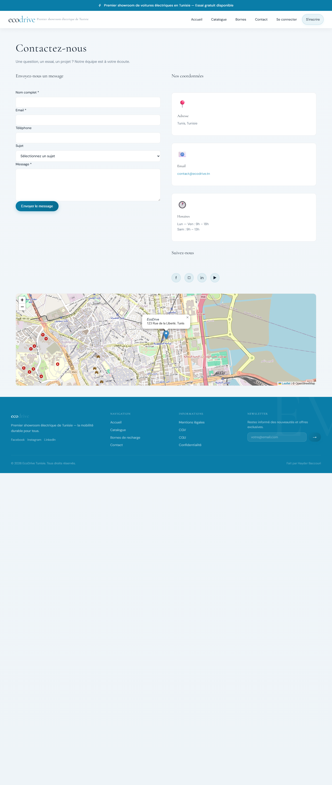

## II. Développement du Sprint 7 « Tableau de bord, audit et exports »

### 1. Backlog du Sprint 7

| Tâche | Priorité | Durée |
|---|---|---|
| Création des vues : tableau de bord, statistiques, journal d'audit | 2 | 3 jours |
| Requêtes statistiques, agrégations, exports CSV, sauvegarde SQL | 1 | 6 jours |
| Tests et correction des erreurs | 3 | 1 jour |

*Tableau 23 : Le backlog du Sprint 7.*

### 2. Analyse et spécification des besoins

L'administrateur consulte un **tableau de bord** avec des indicateurs clés : taux de confirmation des réservations, essais à venir dans les 7 jours, chiffre d'affaires potentiel confirmé, nouveaux clients du mois. Trois **graphiques Chart.js** (réservations par mois, répartition par statut, voitures les plus demandées) ainsi qu'une table des clients les plus actifs et les dernières actions d'administration. Le **journal d'audit** (`admin_audit`) trace chaque action (ajout/modification/suppression de voiture, de borne, confirmation/annulation de réservation, changement de rôle, suppression d'utilisateur). Enfin, des **exports** permettent de télécharger les données en **CSV** (réservations, voitures, bornes, newsletter, audit) et d'effectuer une **sauvegarde SQL** complète du schéma et des données.

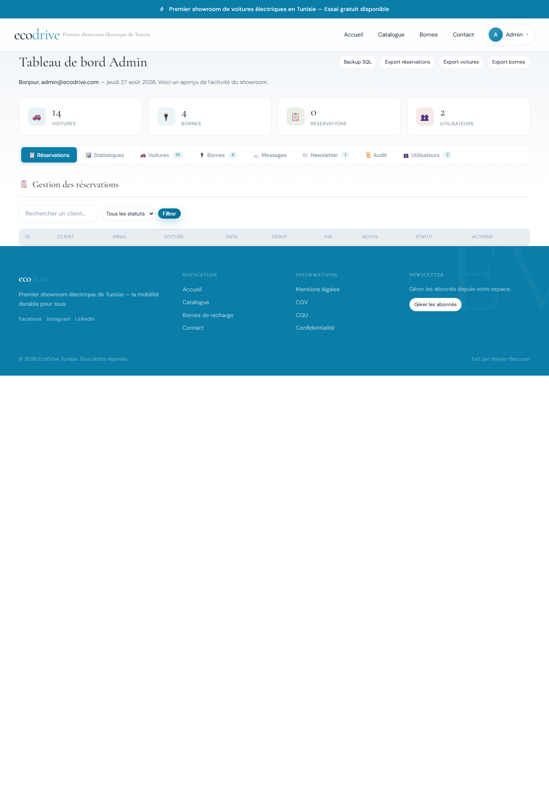

#### Description textuelle « Consulter le tableau de bord » (admin)

| Élément | Description |
|---|---|
| **Résumé** | L'administrateur consulte les statistiques du site |
| **Acteurs** | Administrateur |
| **Pré-condition** | Administrateur authentifié |
| **Post-condition** | Tableau de bord affiché |
| **Scénario nominal** | 1. L'admin ouvre l'onglet « Statistiques » ; 2. Le système calcule les KPIs et génère les graphiques ; 3. Le système affiche le tableau de bord |
| **Scénario d'erreur** | Page introuvable (404) |

*Tableau 24 : La description textuelle « Consulter le tableau de bord » (admin).*

### 3. Réalisation

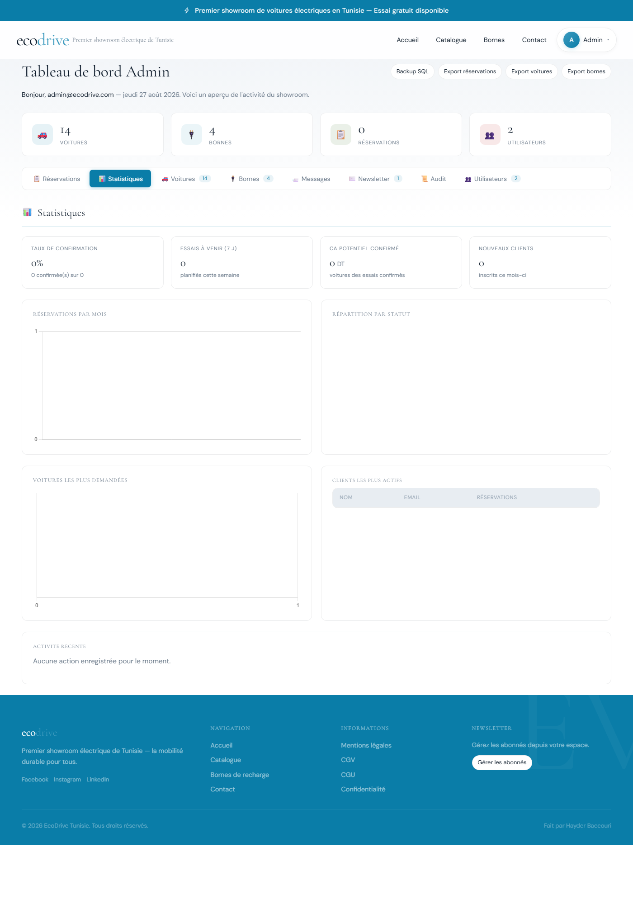

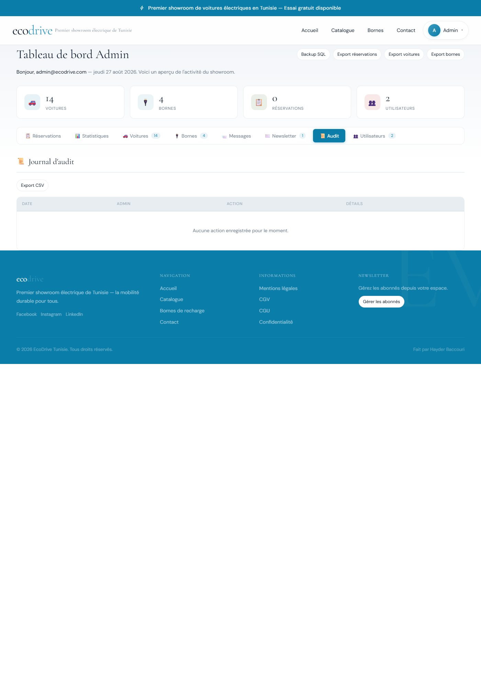

Le panneau d'administration (`php/admin.php`) intègre huit onglets : Réservations, Statistiques, Voitures, Bornes, Messages, Newsletter, Audit et Utilisateurs. Les exports sont gérés par `php/export.php` (CSV avec BOM UTF-8 et sauvegarde SQL).

## Conclusion

Au cours de ce dernier chapitre, nous avons développé les deux derniers sprints : le contact, la newsletter, le tableau de bord statistique, le journal d'audit et les exports. Nous clôturons ce rapport par une conclusion générale.

---

# Conclusion générale et perspectives

Le présent rapport est le résultat de la réalisation de notre projet de fin d'études, développé dans le cadre de l'obtention du Diplôme National de **BTS en Informatique de Gestion**, encadré au sein de l'**ISPRI**. Lors de ce projet, nous avons pu mettre en pratique les connaissances théoriques acquises durant notre formation : analyse et conception de systèmes d'information, modélisation UML, conception de bases de données relationnelles, développement web côté serveur (PHP) et côté client (HTML, CSS, JavaScript), ainsi que les bonnes pratiques de sécurité.

Tout au long de ce projet, nous sommes arrivés à réaliser les objectifs fixés au début : développer une application web complète, **EcoDrive**, qui couvre le showroom, le catalogue de 14 véhicules électriques, les fiches des bornes de recharge Exicom, la réservation d'essais en ligne, l'espace client, le panneau d'administration, le tableau de bord statistique, le journal d'audit et les exports.

Nous avons tout d'abord entamé notre étude par la capture des besoins, étape cruciale pour mieux assimiler le domaine, puis par la définition des principaux intervenants (visiteur, client, administrateur). Ensuite, nous avons procédé à l'analyse et à la conception en utilisant UML comme langage de modélisation. Enfin, l'implémentation nous a permis de développer l'application en tenant compte de l'architecturation matérielle et logicielle (XAMPP, MySQL).

Bien que la solution soit fonctionnelle et sécurisée, il est difficile de prétendre avoir une solution idéale. Nous présentons ci-dessous quelques perspectives d'amélioration :

- **Application mobile** : décliner la partie client en application mobile (ou PWA) pour une meilleure expérience sur smartphone ;
- **Paiement en ligne** : permettre le paiement d'un acompte lors de la réservation ou de l'achat ;
- **Notifications en temps réel** : notification SMS ou push lors du changement de statut d'une réservation ;
- **API REST** : exposer les données (voitures, bornes, réservations) via une API pour une éventuelle intégration mobile ;
- **Multilingue** : ajouter un système d'internationalisation (arabe, français, anglais) ;
- **Cartographie des stations** : géolocaliser les bornes sur une carte interactive ;
- **Gestion des stocks et des devis** : étendre le panneau d'administration vers la gestion commerciale.

Cette application reste ouverte à toute amélioration : elle répond aux besoins communs d'un showroom de véhicules électriques en Tunisie et constitue une base solide et pédagogique pour l'apprentissage du développement web.

---

# Glossaire

- **API** : Application Programming Interface — interface de programmation applicative.
- **Agile** : approche itérative et incrémentale de gestion de projet.
- **Auth** : authentification — vérification de l'identité d'un utilisateur.
- **bcrypt** : algorithme de hachage de mots de passe.
- **CSRF** : Cross-Site Request Forgery — attaque visant à exécuter des actions non consenties.
- **DAO** : Data Access Object — objet d'accès aux données.
- **DT/DN** : Dinar tunisien — devise tunisienne.
- **HTTP** : HyperText Transfer Protocol.
- **ICS** : format iCalendar (RFC 5545) d'export d'événements calendrier.
- **JSON-LD** : JavaScript Object Notation for Linked Data — balisage de données structurées.
- **KPI** : Key Performance Indicator — indicateur clé de performance.
- **MVC** : Model-View-Controller — architecture de séparation modèle/vue/contrôleur.
- **MySQL / MariaDB** : systèmes de gestion de base de données relationnels.
- **ORM** : Object-Relational Mapping.
- **PHP** : langage de script côté serveur.
- **PFE** : Projet de fin d'études.
- **Rate limiting** : limitation du taux de requêtes (anti-abus).
- **Requête préparée** : requête SQL paramétrée, protection contre l'injection SQL.
- **Responsive** : design adaptatif aux tailles d'écran.
- **REST** : Representational State Transfer — style architectural d'API web.
- **Scrum** : framework agile de gestion de projet.
- **SEO** : Search Engine Optimization — référencement naturel.
- **SGBD** : Système de Gestion de Base de Données.
- **Sprint** : itération de développement en Scrum.
- **UML** : Unified Modeling Language — langage de modélisation unifié.

---

# Bibliographie

[1] PHP Manual — Documentation officielle du langage PHP. https://www.php.net/manual/fr/ [En ligne ; consultée en 2025-2026].

[2] MySQL Documentation — Manuel de référence. https://dev.mysql.com/doc/ [En ligne ; consultée en 2025-2026].

[3] MDN Web Docs — Ressources HTML, CSS et JavaScript. https://developer.mozilla.org/fr/ [En ligne ; consultée en 2025-2026].

[4] Chart.js Documentation. https://www.chartjs.org/docs/ [En ligne ; consultée en 2025-2026].

[5] Leaflet — Documentation officielle. https://leafletjs.com/ [En ligne ; consultée en 2025-2026].

[6] RFC 5545 — Internet Calendaring and Scheduling Core Object Specification. https://datatracker.ietf.org/doc/html/rfc5545 [En ligne ; consultée en 2025-2026].

[7] Schema.org — Vocabulaire des données structurées. https://schema.org/ [En ligne ; consultée en 2025-2026].

[8] XAMPP — Documentation et téléchargement. https://www.apachefriends.org/ [En ligne ; consultée en 2025-2026].

[9] OpenClassrooms — Cours de développement web (PHP/MySQL). https://openclassrooms.com/ [En ligne ; consultée en 2025-2026].

[10] Wikipedia — « Méthode agile », « Scrum », « Modèle-vue-contrôleur ». https://fr.wikipedia.org/ [En ligne ; consultée en 2025-2026].

[11] LinkedIn — « Institut des Sciences Privées International (ISPRI) », présentation officielle de l'institut. https://www.linkedin.com/company/institut-des-sciences-priv%C3%A9es-international-ispri/ [En ligne ; consultée en 2025-2026].

---

# Résumé

Le présent projet consiste à concevoir et réaliser une application web de showroom et de catalogue de véhicules électriques en Tunisie, baptisée **EcoDrive**. L'application offre un catalogue de 14 véhicules électriques avec fiches techniques, la présentation de bornes de recharge Exicom, la réservation d'essais en ligne, un espace client, un panneau d'administration complet (gestion des voitures, bornes, réservations, messages, newsletter, utilisateurs), un tableau de bord statistique, un journal d'audit et des exports CSV. Le projet est développé avec PHP 8, MySQL (MariaDB), HTML, CSS et JavaScript vanilla, sous la pile XAMPP, en adoptant une méthodologie agile inspirée de Scrum et la modélisation UML.

**Mots clés :** Véhicule électrique, Showroom, Catalogue, PHP, MySQL, Réservation, Méthode agile (Scrum), Sécurité web, Tunisie.

# Abstract

This project consists of designing and building a web application — a showroom and catalog of electric vehicles in Tunisia, named **EcoDrive**. The application offers a catalog of 14 electric vehicles with technical sheets, Exicom charging stations products, online test-drive booking, a customer area, a complete administration panel (management of cars, charging stations, bookings, messages, newsletter, users), a statistics dashboard, an audit log and CSV exports. The project is developed with PHP 8, MySQL (MariaDB), HTML, CSS and vanilla JavaScript, on the XAMPP stack, adopting an Agile methodology inspired by Scrum and UML modeling.

**Keywords :** Electric vehicle, Showroom, Catalogue, PHP, MySQL, Booking, Scrum, Web security, Tunisia.

---

*Rapport rédigé par Hayder Baccouri — Session Octobre 2024/2026 — ISPRI.*